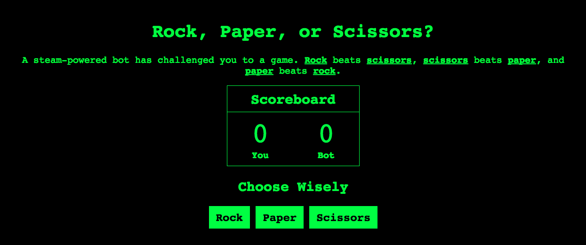

# Rock paper scissors

Time to build your first game! This one's a classic.

### Requirements

Build a web-based game of Rock, Paper, Scissors using HTML, CSS, and JavaScript. Here are details:

- Game rules are as we know them
  - rock beats scissors
  - scissors beats paper
  - paper beats rock
- Scoreboard interface
  - each winning round constitutes 1 point
  - shows a live tally of user's score vs bot's score
  - is updated based on actions taken by user and the outcome of each round
- Technical requirements
  - use jQuery
  - try to use at least 5 different named functions
  - name your functions and variables sensibly (the litmus test: you should be confident that you'll be able to understand your JavaScript code if you revisited it 1 month from now)
  - (bonus A) try to use a function with at least 1 parameter/argument
  - (bonus B1) set a predefined score that constitutes a victory and stop the game
  - (bonus B2) add a reset button to restart the game with 0 0 score

### How to move forward when stuck

Use the Read-Search-Ask methodology (made popular by the [Freecodecamp](https://forum.freecodecamp.org/t/the-read-search-ask-methodology-for-getting-unstuck/137307) community):

1. Read the documentation or error message (in your browser console)
1. Search google
1. Ask for help

When asking for help, ask yourself these questions beforehand:

1. Is it just syntax that you need help identifying in order to move forward? If yes, chances are that you can easily google it
1. Or are you missing a high level piece of information about how to do something? If so, try googling the question _as if you were asking another person_
1. Still no luck? Ask one of your classmates if they seem available
1. If all else fails, ask your instructor! Practice being specific with your question:
    - What are you trying to do that you're stuck at?
    - What is the problem you're facing?
    - What solutions have you tried?
    - Do you have any suspicions as to why your code isn't working?
